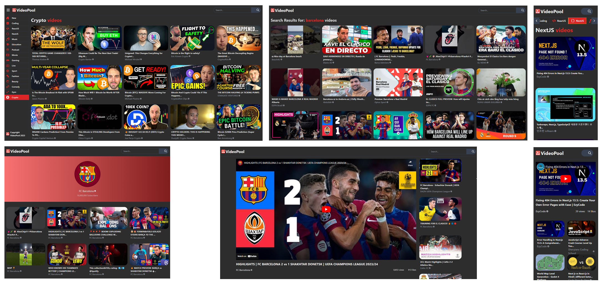

# VideoPool

## [Live Site](https://the-video-pool.vercel.app)

 

## Description

A YouTube-like website, that uses [Youtube v3 API](https://rapidapi.com/ytdlfree/api/youtube-v31) to fetch the data.

 

## Screenshot

 

## 🛠️ Built with:

